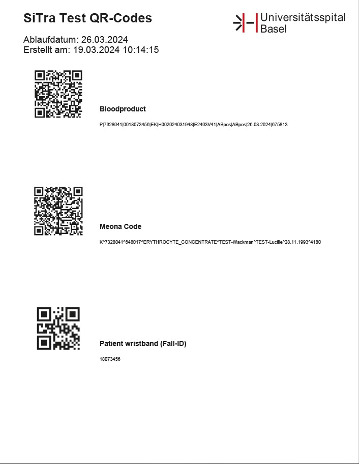

# SiTra QR Code Generator - UHBS

<p align="center">

</p>

## About
A specialized QR code generator developed for the University Hospital Basel (UHBS) blood bank. This application streamlines the process of generating standardized QR codes for blood products, ensuring accurate tracking and identification throughout the hospital system.

## Key Features
- **Blood Product QR Codes**: Generates standardized QR codes for blood products
- **Patient Data Integration**: Supports both manual and random patient data generation
- **Blood Group Compatibility**: Ensures correct blood group formatting and compatibility
- **PDF Generation**: Creates professional PDFs with QR codes and hospital branding
- **Preview Function**: View QR codes and their content before generating PDFs
- **User-Friendly Interface**: Modern GUI with intuitive controls and date picker

## Quick Start
1. Download the latest release
2. Run `SiTra-QR-Generator.exe`
3. Enter or generate patient data
4. Preview QR codes if needed
5. Generate and save the PDF

## For Developers

### Prerequisites
- Python 3.8 or higher
- Virtual environment (recommended)

### Setup
```bash
# Clone repository
git clone https://github.com/hadzicni/SiTra-QR-Code-Generator-UHBS.git
cd SiTra-QR-Code-Generator-UHBS

# Create and activate virtual environment
python -m venv .venv
.venv\Scripts\activate

# Install dependencies
pip install -r requirements.txt

# Run application
python main.py
```

### Build Executable
```bash
pip install pyinstaller
pyinstaller sitra_qr_generator.spec
```

## Contact
For questions or support, contact:
- **Developer**: Nikola Hadzic
- **Email**: nikola.hadzic@usb.ch

## License
This project is proprietary software developed for UHBS. All rights reserved.

---
 2025 University Hospital Basel (UHBS). Version 3.0
